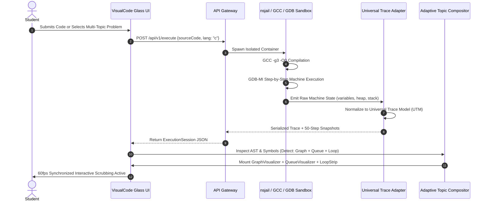

# PRODUCT REQUIREMENTS DOCUMENT (PRD)

---

# VISUALCODE
## *"Don't just run your code. Watch your code run."*

**Document Version:** 2.0.0-PROD  
**Status:** Approved for Multi-Topic Adaptive Visualization Engine Implementation  
**Product Classification:** Developer Tool, Computational Laboratory & Adaptive Interactive Learning Platform  
**Target Systems:** Web (Desktop & Mobile Responsive), Isolated Sandbox Cloud Infrastructure  
**Core Reference Architecture:** C11 / GCC / GDB-MI / Universal Trace Model (UTM) / Glassmorphic Reactive Canvas  
**Security Standard:** Zero-Trust Containerized Ephemeral Sandboxing (nsjail / cgroups v2 / seccomp-bpf)  

---

## TABLE OF CONTENTS
1. [Cover Page & Document Control](#1-cover-page--document-control)
2. [Executive Summary](#2-executive-summary)
3. [Product Vision & Core Philosophy](#3-product-vision--core-philosophy)
4. [Problem Statement & Learning Gap Analysis](#4-problem-statement--learning-gap-analysis)
5. [Target Users & Audience Segmentation](#5-target-users--audience-segmentation)
6. [User Personas & Mental Model Analysis](#6-user-personas--mental-model-analysis)
7. [Core Product Modes (A, B, C, D)](#7-core-product-modes)
8. [End-to-End User Journeys & State Transitions](#8-end-to-end-user-journeys--state-transitions)
9. [Functional Requirements Specification](#9-functional-requirements-specification)
10. [Real Execution Architecture](#10-real-execution-architecture)
11. [Universal Trace Engine & Event Specification](#11-universal-trace-engine--event-specification)
12. [Execution Session Model & Snapshot Storage](#12-execution-session-model--snapshot-storage)
13. [Deterministic Replay & Scrubbing Engine](#13-deterministic-replay--scrubbing-engine)
14. [Internal Visualization Levels (L1 to L4)](#14-internal-visualization-levels)
15. [Adaptive Multi-Topic Visualization Engine Architecture](#15-adaptive-multi-topic-visualization-engine-architecture)
16. [Comprehensive Topic Coverage & Visual Specifications](#16-comprehensive-topic-coverage--visual-specifications)
17. [Compound & Multi-Topic Problem Composition](#17-compound--multi-topic-problem-composition)
18. [Competitive Benchmark Analysis & Leading Visualization Sources](#18-competitive-benchmark-analysis--leading-visualization-sources)
19. [Glass Edition Animation Physics & Micro-Interaction Specifications](#19-glass-edition-animation-physics--micro-interaction-specifications)
20. [C Runtime Architecture (Primary MVP Foundation)](#20-c-runtime-architecture)
21. [Java & Python Runtime Extensibility Architecture](#21-java--python-runtime-extensibility-architecture)
22. [Security Architecture & Sandboxing Engine](#22-security-architecture--sandboxing-engine)
23. [Performance Standards & Latency Budgets](#23-performance-standards--latency-budgets)
24. [Accessibility (a11y) & Neurodivergent Ergonomics](#24-accessibility-a11y--neurodivergent-ergonomics)
25. [Database Schema & Persistence Design](#25-database-schema--persistence-design)
26. [API Specifications & Wire Protocols](#26-api-specifications--wire-protocols)
27. [Frontend Component Hierarchy & State Management](#27-frontend-component-hierarchy--state-management)
28. [Backend Component Architecture & Micro-services](#28-backend-component-architecture--micro-services)
29. [Monorepo Project Structure & Dependency Graph](#29-monorepo-project-structure--dependency-graph)
30. [Design System Tokens, Typography & Component Styling](#30-design-system-tokens-typography--component-styling)
31. [Interactive Inspection & Dynamic Inquiries](#31-interactive-inspection--dynamic-inquiries)
32. [Pedagogical Learning Features](#32-pedagogical-learning-features)
33. [AI Integration Architecture & Prompt Guardrails](#33-ai-integration-architecture--prompt-guardrails)
34. [AI Problem Analyzer Specification](#34-ai-problem-analyzer-specification)
35. [Technology Stack: Build vs. Buy Decision Matrix](#35-technology-stack-build-vs-buy-decision-matrix)
36. [MVP Definition & Deliverables](#36-mvp-definition--deliverables)
37. [Flagship 30-Second Demonstration Script](#37-flagship-30-second-demonstration-script)
38. [Phased Product Roadmap (Phase 0 to Phase 10)](#38-phased-product-roadmap)
39. [Risk Assessment & Technical Mitigation Strategies](#39-risk-assessment--technical-mitigation-strategies)
40. [Technical Limitations & Undefined Behavior (UB) Boundaries](#40-technical-limitations--undefined-behavior-ub-boundaries)
41. [System Observability, Telemetry & Diagnostics](#41-system-observability-telemetry--diagnostics)
42. [Testing Strategy & Verification Matrices](#42-testing-strategy--verification-matrices)
43. [Definition of Done (DoD)](#43-definition-of-done-dod)
44. [Product Differentiation Matrix](#44-product-differentiation-matrix)
45. [Product Analytics & Pedagogical Metrics](#45-product-analytics--pedagogical-metrics)
46. [Success Criteria & Target Key Performance Indicators (KPIs)](#46-success-criteria--target-key-performance-indicators-kpis)
47. [Future Horizons & Long-Term Feature Extensions](#47-future-horizons--long-term-feature-extensions)
48. [Final Product Definition & Manifesto](#48-final-product-definition--manifesto)
49. [Formal References & Academic Citations](#49-formal-references--academic-citations)

---

# 1. COVER PAGE & DOCUMENT CONTROL

### Metadata
* **Title:** VisualCode Product Requirements Document & Technical Blueprint
* **Tagline:** *"Don't just run your code. Watch your code run."*
* **Author:** DeepMind / Antigravity Engineering Architecture Taskforce
* **Version:** 2.0.0-PROD (Enhanced with Adaptive Multi-Topic Visualization Engine)
* **Target Audience:** Frontend/UI Engineers, Backend Systems Architects, Security Engineers, Pedagogical Researchers, Visual Designers
* **Revision History:**
  * `v0.1.0`: Concept & Scope Draft
  * `v1.0.0`: Production Master PRD — Multi-tier Renderers, Security Sandboxing, Pedagogical Engine
  * `v2.0.0`: Adaptive Multi-Topic Composition Engine, Glass Edition Animation Physics, and Best-of-Breed Visualization Sources Integration

---

# 2. EXECUTIVE SUMMARY

### 2.1 What VisualCode Is
**VisualCode** is a computational laboratory and interactive programming-learning environment. It bridges the cognitive chasm in software education: the divide between static source code syntax, machine runtime execution, and human mental models.

VisualCode compiles and runs the student's **actual code** inside a hardened, isolated Linux sandbox (`nsjail` + GCC). It converts concrete machine events (registers, stack frames, memory allocations, pointer mutations, branching conditions) into a high-fidelity **Universal Trace Model (UTM)** that drives an interactive, synchronized, multi-panel visual canvas at 60 frames per second.

```
       STATIC CODE              COMPILER / GDB-MI              VISUALCODE
┌──────────────────────┐     ┌─────────────────────┐     ┌──────────────────────┐
│ int a[] = {5, 2, 9}; │ ──> │ GCC -g3 -> GDB-MI   │ ──> │ Reactive Data Canvas │
│ int max = a[0];      │     │ Capture Mutations   │     │ Memory Pointer Maps  │
│ for(int i=1; i<3;..) │     │ Structured JSON/UTM │     │ Synchronized Scrub   │
└──────────────────────┘     └─────────────────────┘     └──────────────────────┘
```

### 2.2 Core Breakthrough: Adaptive Multi-Topic Composition
Real-world algorithmic problems are rarely confined to a single isolated topic. A Breadth-First Search problem combines **Graphs**, **Queues**, **Arrays (visited map)**, and **Loops**. A Dynamic Programming problem combines **Recursion**, **Arrays/Matrices**, and **Subproblem Dependency Graphs**. 

VisualCode dynamically detects all underlying concepts present in the learner's program and **combines their respective visualizations into an orchestrated, multi-panel visual story**. If a problem uses a Hash Table with Chaining, the system simultaneously displays the **Hash Function Chip Flow**, the **Bucket Collision Radar**, and the **Linked List Pointer Links**.

### 2.3 First Technical Principle: Real Execution is the Source of Truth
VisualCode never fabricates program behavior using AI. The execution engine runs the user's actual program using real language runtimes. AI may explain, classify, organize, and guide the learner, but it must never invent runtime state.

---

# 3. PRODUCT VISION & CORE PHILOSOPHY

### 3.1 Vision Statement
> *"To turn every computer program into a living, transparent, inspectable machine, so that anyone, anywhere can develop true intuition for how software works."*

### 3.2 Core Tenets of Visual Learning
1. **Physicality of Computation:** Variables are real containers; pointers are physical directed vectors; memory addresses are real numerical locations.
2. **Kinetic Causality:** State changes must have an observable cause. If a variable changes, the expression that caused it must be seen evaluating and transferring into that storage location.
3. **Adaptive Harmony:** Compound topics must not fight for screen real estate; the layout engine must adaptively orchestrate multiple visualizers based on the active line and data dependencies.

---

# 4. PROBLEM STATEMENT & LEARNING GAP ANALYSIS

| Learning Barrier | Conventional Experience | VisualCode Remediated Experience |
| :--- | :--- | :--- |
| **1. Variable Blindness** | `x = x + 1;` is read statically; mutations are imagined. | Elastic bounce assignment; old value strikes out, new value fades in with color diff pill. |
| **2. Loop Invariant Simulation** | Students get lost in nested iterations. | 3D receding iteration trail showing past, current, and future loop iterations. |
| **3. Condition Opacity** | `if (a[i] > max)` is evaluated blindly. | Amber scanpulse radar substituting real values (`9 > 5`) resolving green (true) or red (false). |
| **4. Call Stack & Recursion** | Stack frames are abstract drawings. | Sliding vertical stack frames + branching recursive tree with unwind return bubbling. |
| **5. Pointer Indirection** | Pointers are confusing arrows on blackboards. | SVG Bezier vectors linking pointer cells to real memory addresses on Stack and Heap. |
| **6. Dynamic Memory Leaks** | `malloc` and `free` produce silent leaks. | Visual Heap blocks with real-time leak radar warning if pointer is reassigned before free. |
| **7. Compound Topic Confusion** | Problems combining Queue + Graph or Tree + Stack overwhelm students. | Unified Adaptive Compositor that renders synchronized visual panels reacting to the same step. |

---

# 5. TARGET USERS & AUDIENCE SEGMENTATION

* **Primary: Undergraduate CS / Engineering Students (B.Tech, B.S. CS, IT, ECE):** Enrolled in C programming, Data Structures, and Algorithms courses.
* **Primary: Competitive Programming Learners:** Mastering arrays, two pointers, binary search, sliding windows, graphs, and dynamic programming.
* **Secondary: Coding Bootcamp & Self-Taught Learners:** Transitioning into tech who need mental model clarity without academic jargon.
* **Secondary: University Professors & Tutors:** Needing an authoritative, zero-boilerplate classroom visual presentation tool.

---

# 6. USER PERSONAS & MENTAL MODEL ANALYSIS

* **Persona 1: Aarav (1st Year Engineering Student):** Struggles with pointers and segmentation faults in C. Needs to see why `ptr->next = NULL` failed and where `ptr` was pointing.
* **Persona 2: Elena (Bootcamp Career Switcher):** Struggles with loop boundaries and index tracking (`i`, `j`). Needs multi-pointer markers and live comparison highlights.
* **Persona 3: Prof. Vance (CS Faculty):** Needs to demonstrate Breadth-First Search on a graph while keeping the queue and visited array simultaneously visible to 120 lecture students.

---

# 7. CORE PRODUCT MODES

```
                             VISUALCODE MODES
┌──────────────────────┬──────────────────────┬──────────────────────┬──────────────────────┐
│ MODE A: UNDERSTAND   │ MODE B: LEARN        │ MODE C: VISUALIZE    │ MODE D: DEBUG        │
│ A PROBLEM            │ A CONCEPT            │ MY CODE (Flagship)   │ MY CODE              │
├──────────────────────┼──────────────────────┼──────────────────────┼──────────────────────┤
│ Plain-text question  │ Interactive curated  │ Arbitrary user code  │ Visual error mapping │
│ decomposition with   │ canonical modules    │ execution in sandbox │ of segfaults, memory │
│ progressive hints.   │ with play/step.      │ with 60fps scrubber. │ leaks, and UB.       │
└──────────────────────┴──────────────────────┴──────────────────────┴──────────────────────┘
```

---

# 8. END-TO-END USER JOURNEYS & STATE TRANSITIONS



---

# 9. FUNCTIONAL REQUIREMENTS SPECIFICATION

* **FR-ED-01:** Monaco code editor with custom C11 language server and reactive line glow.
* **FR-EX-01:** Real compilation with GCC 12+ and GDB-MI execution inside unprivileged `nsjail`.
* **FR-TR-01:** Extraction of granular machine mutations into standardized UTM events.
* **FR-CP-01 (Adaptive Composition):** Automatic detection and concurrent rendering of composite topics (Graph + Queue, Tree + Recursion, DP Table + Array, Hash Table + Linked List, Bitwise + Loops).
* **FR-PB-01:** Bidirectional timeline scrubber with $O(1)$ seeking via 50-step memory snapshots.
* **FR-AI-01:** Socratic progressive hints (Level 1 to 4) without revealing full solutions.

---

# 10. REAL EXECUTION ARCHITECTURE

The execution engine runs untrusted C code inside an unprivileged Linux container:

```bash
# Compilation flags strictly enforced for deterministic execution
gcc -std=c11 -g3 -O0 \
    -fno-inline \
    -fno-omit-frame-pointer \
    -fno-builtin \
    -Wall -Wextra \
    -o /tmp/sandbox/prog /tmp/sandbox/main.c -lm
```

- `-g3 -O0`: Ensures complete DWARF-4 debug symbols and guarantees a 1:1 mapping between source code lines and machine execution steps without compiler reordering.
- Programmatic GDB-MI driver communicates with GDB via pipe, issuing `-exec-step`, capturing locals (`-stack-list-locals --simple-values`), call stack (`-stack-list-frames`), and memory blocks.

---

# 11. UNIVERSAL TRACE ENGINE & EVENT SPECIFICATION

```typescript
export type EventType =
  | 'PROGRAM_START'       | 'PROGRAM_END'
  | 'VARIABLE_CREATE'     | 'VARIABLE_READ'      | 'VARIABLE_WRITE'
  | 'ARRAY_CREATE'        | 'ARRAY_READ'         | 'ARRAY_WRITE'
  | 'CONDITION_EVALUATE'  | 'LOOP_START'         | 'LOOP_ITERATION'    | 'LOOP_END'
  | 'FUNCTION_CALL'       | 'FUNCTION_RETURN'    | 'STACK_FRAME_CREATE'| 'STACK_FRAME_DESTROY'
  | 'MEMORY_ALLOCATE'     | 'MEMORY_READ'        | 'MEMORY_WRITE'      | 'MEMORY_FREE'
  | 'POINTER_READ'        | 'POINTER_WRITE'      | 'REFERENCE_CREATE'  | 'REFERENCE_CHANGE'
  | 'NODE_CREATE'         | 'NODE_DELETE'        | 'NODE_LINK'         | 'NODE_UNLINK'
  | 'GRAPH_VISIT'         | 'GRAPH_EDGE_RELAX'   | 'TREE_INSERT'       | 'TREE_TRAVERSE'
  | 'HASH_CALCULATE'      | 'HASH_COLLISION'     | 'DP_CELL_FILL'      | 'BIT_OPERATION'
  | 'COMPARE'             | 'SWAP'               | 'OUTPUT'            | 'ERROR';

export interface UTMEvent {
  id: number;
  step: number;
  type: EventType;
  sourceLine: number;
  scope: string;
  depth: number;
  payload: Record<string, any>;
  stdoutDelta?: string;
  activeTopics?: string[]; // Detected topics: ['graph', 'queue', 'loop']
}
```

---

# 12. EXECUTION SESSION MODEL & SNAPSHOT STORAGE

Execution sessions are immutable and self-contained. To enable instantaneous seeking across thousands of steps, full memory keyframe snapshots are captured every 50 events:

$$\text{Target Event } E_{73} \implies \text{Load Snapshot } S_{50} + \text{Apply Deltas } \Delta_{51..73} \quad (\text{Execution Time } < 2\text{ms})$$

---

# 13. DETERMINISTIC REPLAY & SCRUBBING ENGINE

The browser Replay Engine maintains an in-memory virtual state store. Forward stepping applies event deltas; backward stepping rolls back state using keyframe snapshots and delta inverse applications. All transport actions (First, Prev, Play, Pause, Next, Last, Speed, Scrub) emit a unified state update to all active visualizer panels.

---

# 14. INTERNAL VISUALIZATION LEVELS (L1 TO L4)

- **L1 (Beginner):** Focus on variables, values, loop iteration counts, and simple array cell updates. Raw hex addresses are hidden.
- **L2 (Execution):** Introduces scoped stack frames, call parameters, return values, struct composite cards.
- **L3 (Runtime / Memory):** Exposes physical hexadecimal RAM addresses (`0x7ffd...`), dynamic heap memory blocks (`malloc`/`free`), and reactive SVG pointer vectors.
- **L4 (Advanced Internal):** Systems details: memory byte alignments, struct padding (+0x00, +0x04), disassembly line-sync, and instruction-level tracking where available.

---

# 15. ADAPTIVE MULTI-TOPIC VISUALIZATION ENGINE ARCHITECTURE

This is the core architectural differentiator of VisualCode:

```
                               ADAPTIVE COMPOSITOR PIPELINE
                               ┌─────────────────────────┐
                               │ Real C Execution Trace  │
                               └────────────┬────────────┘
                                            │
                                            ▼
                               ┌─────────────────────────┐
                               │ Topic Detection Engine  │
                               │ - AST Pattern Matcher   │
                               │ - Symbol Type Analyzer  │
                               │ - Trace Event Classifier│
                               └────────────┬────────────┘
                                            │ Identified Topics
                                            ▼
                        ┌───────────────────────────────────────┐
                        │   Multi-Topic Coordinator Bus         │
                        │   - Synchronizes Active Entities      │
                        │   - Allocates Glass Panel Layout      │
                        └───────┬───────────────┬───────┬───────┘
                                │               │       │
            ┌───────────────────┴───┐           │       └───────────────────┐
            ▼                       ▼           ▼                           ▼
    ┌───────────────┐       ┌───────────────┐ ┌───────────────┐     ┌───────────────┐
    │ GraphVisualizer│      │QueueVisualizer│ │ LoopCondition │     │ VariableView  │
    │ (Nodes & BFS) │       │ (FIFO Tube)   │ │ Strip (Radar) │     │ (Value Diff)  │
    └───────┬───────┘       └───────┬───────┘ └───────┬───────┘     └───────┬───────┘
            │                       │                 │                     │
            └───────────────────────┴────────┬────────┴─────────────────────┘
                                             │
                                             ▼
                               ┌─────────────────────────┐
                               │ Glassmorphic Master View│
                               │ Responsive Composited UI│
                               └─────────────────────────┘
```

---

# 16. COMPREHENSIVE TOPIC COVERAGE & VISUAL SPECIFICATIONS

VisualCode provides dedicated visual behaviors across all major Computer Science topics:

### 16.1 Fundamentals, Conditions & Loops
- **Variable Assignment:** Value bounces elastically into variable card; right-hand expression collapses into resolved value before entering container.
- **Conditions:** Amber scanpulse glow on `a > b`; substituted values (`9 > 5`) resolve to bright emerald green (true) or rose red (false); taken branch illuminates while skipped branch dims.
- **Loops:** 3D receding iteration trail where completed steps recede into background perspective (`opacity: 0.5; transform: scale(0.93)`), current iteration scales up (`1.15x`) with neon-cyan halo.

### 16.2 Dynamic Programming (DP)
- **Table / Memoization Grid:** Cells bounce-fill with animated numbers.
- **Subproblem Dependency Curves:** Pulsing dashed SVG curves flow from subproblem cells (e.g. `dp[i-1]` and `dp[i-2]`) into the current cell (`dp[i]`), making algorithmic recurrence physically visible.

### 16.3 Bit Manipulation
- **3D Flip Cards:** Each bit (0 or 1) is rendered on a 3D perspective card. Bitwise operations (AND, OR, XOR, shifts) flip each bit on the Y-axis with glowing neon-amber verification before resting in emerald green.

### 16.4 Hash Tables & Hashing
- **Chip Flow:** Key $\to$ `hash(key)` $\to$ index passes through a glowing chip pipeline.
- **Collision Reaction:** When two keys map to the same bucket, the bucket shakes horizontally in rose-red; the collision resolves into an animated linked list chain dropping in with magnetic bezier curves.

### 16.5 Graphs (BFS / DFS / Shortest Path)
- **Frontier Pulse Wave:** Discovered nodes pulse outward with a glowing blue wavefront.
- **Edge Relaxation:** Active edges glow with neon pulse; visited nodes receive a persistent green halo.
- **Live Queue/Stack Panel:** The BFS Queue or DFS Stack is rendered directly alongside the graph, animating items sliding in and popping out synchronously with node visits.

### 16.6 Trees (BST / Traversals)
- **Comparison Path:** Top-down search pulses nodes in amber down the tree (`val < node->val`).
- **Insertion:** New node bounces in elastically; new glowing edge draws downward from parent.
- **Traversal Sequence:** Live sequence chip strip builds at the bottom, registering elements in Inorder/Preorder/Postorder sequence as each node is processed.

---

# 17. COMPOUND & MULTI-TOPIC PROBLEM COMPOSITION

When a problem exercises multiple data structures or algorithmic paradigms, VisualCode automatically composites their views:

```
┌───────────────────────────────────────────────┬─────────────────────────────────────────────────────────────┐
│ Problem Pattern                               │ Composited Visual Panels & Coordinated Animation            │
├───────────────────────────────────────────────┼─────────────────────────────────────────────────────────────┤
│ 1. Graph BFS with Queue                       │ GraphVisualizer (Nodes/Edges) + QueueVisualizer (FIFO pipe) │
│                                               │ + LoopConditionStrip. Dequeuing an item illuminates the     │
│                                               │ graph node's outgoing edges.                                │
├───────────────────────────────────────────────┼─────────────────────────────────────────────────────────────┤
│ 2. Tree Traversal with Call Stack (Recursion) │ TreeVisualizer (Hierarchy) + StackDiagramView (Call Frames) │
│                                               │ + Traversal Sequence Strip. Recursing deeper pushes frames   │
│                                               │ and highlights tree nodes in synchrony.                     │
├───────────────────────────────────────────────┼─────────────────────────────────────────────────────────────┤
│ 3. Hash Table with Chaining                   │ HashTableVisualizer (Buckets) + LinkedListView (Chains)     │
│                                               │ + Chip Pipeline. Collision triggers bucket red shake and    │
│                                               │ attaches a new linked node card.                            │
├───────────────────────────────────────────────┼─────────────────────────────────────────────────────────────┤
│ 4. DP Memoization (Top-Down with Recursion)   │ DPVisualizer (Table) + RecursionTreeView + Stack Frames.    │
│                                               │ Memoized lookup cancels tree branching and highlights table.│
├───────────────────────────────────────────────┼─────────────────────────────────────────────────────────────┤
│ 5. Bitmask DP or Bitwise in Loops             │ BitVisualizer (3D Flip Bits) + LoopConditionStrip           │
│                                               │ + VariableView. Loop iterations trigger bit card flips.     │
└───────────────────────────────────────────────┴─────────────────────────────────────────────────────────────┘
```

---

# 18. COMPETITIVE BENCHMARK ANALYSIS & LEADING VISUALIZATION SOURCES

VisualCode synthesizes the strongest architectural patterns from the world's most acclaimed visualization systems:

```
┌────────────────────────┬─────────────────────────────┬──────────────────────────────────────────────────────┐
│ Leading Source         │ Core Architectural Strength │ VisualCode Synthesis & Enhancement                   │
├────────────────────────┼─────────────────────────────┼──────────────────────────────────────────────────────┤
│ 1. VisuAlgo            │ Algorithmic pseudocode      │ Adopted: Side-by-side execution highlight.           │
│    (Steven Halim, NUS) │ synchronization; graph &    │ Enhanced: Runs REAL C user code instead of canned    │
│    [visualgo.net]      │ tree animation models.      │ hardcoded scripts.                                   │
├────────────────────────┼─────────────────────────────┼──────────────────────────────────────────────────────┤
│ 2. Python Tutor        │ Ground-truth execution      │ Adopted: Real execution runtime frame inspection.    │
│    (Philip Guo, UCSD)  │ stack frames and memory     │ Enhanced: 60fps glassmorphic canvas, SVG pointer     │
│    [pythontutor.com]   │ object reference arrows.    │ vectors, dynamic arrays, and responsive mobile UI.   │
├────────────────────────┼─────────────────────────────┼──────────────────────────────────────────────────────┤
│ 3. Algorithm           │ Multi-tracer modularity     │ Adopted: Decoupled domain tracers (Array, Graph).    │
│    Visualizer          │ (LogTracer, Array1DTracer,  │ Enhanced: Zero tracer boilerplate needed in user     │
│    [github.com]        │ GraphTracer).               │ code; GDB-MI extracts data non-intrusively.          │
├────────────────────────┼─────────────────────────────┼──────────────────────────────────────────────────────┤
│ 4. Red Blob Games      │ Intuitive spatial diagrams; │ Adopted: Frontier pulse wavefronts and reactive      │
│    (Amit Patel)        │ interactive graph & grid    │ interactive sliders for spatial algorithms.          │
│    [redblobgames.com]  │ exploration.                │                                                      │
├────────────────────────┼─────────────────────────────┼──────────────────────────────────────────────────────┤
│ 5. Brilliant.org       │ Socratic step-by-step       │ Adopted: "Predict Next Step" interactive checkpoints │
│    Interactive         │ challenges; progressive     │ and variable pulse animations.                       │
│    Engineering         │ hints without spoilers.     │                                                      │
├────────────────────────┼─────────────────────────────┼──────────────────────────────────────────────────────┤
│ 6. USFCA Visualization │ Canonical step-by-step data │ Adopted: Discrete state transition tables for BSTs   │
│    (David Galles)      │ structure algorithms.       │ and open-addressing hash collisions.                 │
└────────────────────────┴─────────────────────────────┴──────────────────────────────────────────────────────┘
```

---

# 19. GLASS EDITION ANIMATION PHYSICS & MICRO-INTERACTION SPECIFICATIONS

All animations in VisualCode are built on top of the Glass Edition design system:

```css
/* Glass Edition Core Theme Variables */
:root {
  --glow-blue: #4fc3ff;
  --glow-amber: #ffb74d;
  --glow-green: #4ade80;
  --glow-red: #ff5c7c;
  --glow-purple: #b388ff;
  --glass-bg: rgba(255, 255, 255, 0.05);
  --glass-border: rgba(255, 255, 255, 0.12);
  --glass-blur: blur(22px) saturate(180%);
}
```

### Micro-Interaction Rules
1. **Elastic Bounce (`bounceIn`):** `animation: bounceIn .5s cubic-bezier(.34, 1.56, .64, 1)` used when variables are initialized or nodes enter the canvas.
2. **Scan Pulse (`scanpulse`):** `box-shadow` oscillates between 18px and 34px on comparisons (`amber`) or active execution lines.
3. **3D Card Flip (`flip3d`):** Bits and boolean cards rotate 180 degrees along the Y-axis with `transform-style: preserve-3d`.
4. **Collision Shake (`shake`):** Triggers a 4px horizontal shake on hash bucket collisions or invalid pointer access.
5. **Dashed Dependency Flow (`flowDep`):** SVG dashed lines animate `stroke-dashoffset` smoothly toward the target cell.

---

# 20. C RUNTIME ARCHITECTURE (PRIMARY MVP FOUNDATION)

The C runtime uses GCC 12+ and Python-driven GDB-MI script bridges to sample machine states at line boundaries without requiring any instrumentation code inside the student's source file.

---

# 21. JAVA & PYTHON RUNTIME EXTENSIBILITY ARCHITECTURE

Future JVM and Python adapters hook into the same Universal Trace Model via JVMTI and `sys.settrace`, allowing the entire front-end visualization canvas to remain language-agnostic.

---

# 22. SECURITY ARCHITECTURE & SANDBOXING ENGINE

- Zero network access (`CLONE_NEWNET`).
- CPU quota: 2.0s CPU time / 5.0s wall time.
- Memory quota: 128 MB RAM.
- PID quota: `pids.max = 8`.
- Seccomp-BPF whitelist: blocks `fork`, `execve`, `socket`, `kill`.

---

# 23. PERFORMANCE STANDARDS & LATENCY BUDGETS

- Compilation + Trace: $< 1,200\text{ ms}$.
- Scrubbing Frame Time: $< 16\text{ ms}$ ($60\text{ fps}$).
- Snapshot Seek: $< 30\text{ ms}$.
- Tab Memory Consumption: $< 120\text{ MB}$.

---

# 24. ACCESSIBILITY (A11Y) & NEURODIVERGENT ERGONOMICS

- WCAG 2.1 AA compliant.
- Real-time `aria-live` text narration of visual state mutations.
- Keyboard shortcuts for all playback operations (`Space`, `Arrows`, `Home`, `End`).
- `@media (prefers-reduced-motion)` disables spring physics and applies instant state updates.

---

# 25. DATABASE SCHEMA & PERSISTENCE DESIGN

PostgreSQL entities for production: `users`, `problems`, `execution_sessions`, `user_progress`, `visualization_presets`.

---

# 26. API SPECIFICATIONS & WIRE PROTOCOLS

- `POST /api/v1/execute`: Compiles, traces, and returns UTM session payload.
- `POST /api/v1/explain-event`: Provides Socratic "Why Did This Happen?" analysis for any execution step.
- `POST /api/v1/analyze-problem`: Deconstructs problem descriptions into structured entities, invariants, and progressive hints.

---

# 27. FRONTEND COMPONENT HIERARCHY & STATE MANAGEMENT

```text
AppShell
├── TopNavigationBar
├── WorkspaceSplitter
│   ├── LeftPane: CodeWorkbench (Monaco Editor, Gutter Breakpoints)
│   └── RightPane: VisualizationCanvas
│       ├── AdaptiveCompositor (Orchestrates active domain visualizers)
│       │   ├── ArrayView
│       │   ├── TreeVisualizer
│       │   ├── GraphVisualizer
│       │   ├── HashTableVisualizer
│       │   ├── BitVisualizer
│       │   ├── DPVisualizer
│       │   ├── StackVisualizer
│       │   ├── QueueVisualizer
│       │   ├── LinkedListView
│       │   ├── PointerView
│       │   └── HeapView
│       └── LoopConditionStrip (Persistent Status Radar)
├── StateInspectorTabs (Variables, Call Stack, Memory, Console)
└── PlaybackControlsFooter (Fixed Scrubber, Speed Selector, Transport Buttons)
```

---

# 28. BACKEND COMPONENT ARCHITECTURE & MICRO-SERVICES

Node.js API Gateway $\to$ Redis BullMQ Workload Queue $\to$ Ephemeral `nsjail` Sandbox Runners $\to$ C Trace Adapter $\to$ Snapshot Packager.

---

# 29. MONOREPO PROJECT STRUCTURE & DEPENDENCY GRAPH

Structured as a Turborepo workspace with `@visualcode/trace-schema`, `@visualcode/replay-engine`, `@visualcode/visualization-engine`, and domain-specific renderers.

---

# 30. DESIGN SYSTEM TOKENS, TYPOGRAPHY & COMPONENT STYLING

Obsidian palette (`#090D16`), glass surfaces with 22px blur, typography set in **Inter** and **JetBrains Mono**, with semantic neon glows (Amber for active lines, Cyan for array changes, Emerald for true conditions, Rose for errors/collisions).

---

# 31. INTERACTIVE INSPECTION & DYNAMIC INQUIRIES

Users can click any variable or pointer to follow memory links, ask *"Where did this value come from?"*, and compare step differences in real time.

---

# 32. PEDAGOGICAL LEARNING FEATURES

- **Predict Next Step:** Interactive Socratic challenge before evaluating branches.
- **Complexity Radar:** Live counters for comparisons, swaps, allocations, and recursive depth linked to Big-$O$ analysis.

---

# 33. AI INTEGRATION ARCHITECTURE & PROMPT GUARDRAILS

Strict separation of concerns: **Runtime execution is factual truth; AI is strictly for pedagogical interpretation.** AI prompts are bounded strictly by verified UTM payloads.

---

# 34. AI PROBLEM ANALYZER SPECIFICATION

Decomposes plain-text problems into structured JSON with inputs, outputs, invariants, entities, and Level 1–4 progressive hints.

---

# 35. TECHNOLOGY STACK: BUILD VS. BUY DECISION MATRIX

Monaco (Use), GCC/Clang (Use), GDB-MI (Integrate), nsjail (Use), Custom UTM Schema (Build), React + Framer Motion Canvas (Build).

---

# 36. MVP DEFINITION & DELIVERABLES

Focus on C11 fundamentals, arrays, pointers, loops, conditions, functions, call stack, dynamic memory, and the adaptive multi-topic canvas with 5 canonical presets.

---

# 37. FLAGSHIP 30-SECOND DEMONSTRATION SCRIPT

Demonstrates array maximum traversal (`int a[] = {5, 2, 9, 1}; int max = a[0];`) with line-by-line sync, condition radar (`9 > 5 -> TRUE`), and value 9 lifting into `max`.

---

# 38. PHASED PRODUCT ROADMAP (PHASE 0 TO PHASE 10)

Spans from Phase 0 (Trace Schema & Sandbox) to Phase 5 (Advanced DSA Renderers) to Phase 10 (Multi-Tenant Collaborative Classroom).

---

# 39. RISK ASSESSMENT & TECHNICAL MITIGATION STRATEGIES

Mitigations for sandbox escape (nsjail + seccomp), browser tab crash (10,000 event limit), and AI hallucination (strict UTM ground-truth prompts).

---

# 40. TECHNICAL LIMITATIONS & UNDEFINED BEHAVIOR (UB) BOUNDARIES

VisualCode visualizes actual compiled machine behavior for undefined operations (e.g. uninitialized reads) while flagging standard C11 UB warnings.

---

# 41. SYSTEM OBSERVABILITY, TELEMETRY & DIAGNOSTICS

Structured Pino JSON logs, OpenTelemetry execution latency histograms, and client-side frame-drop telemetry.

---

# 42. TESTING STRATEGY & VERIFICATION MATRICES

Unit tests (UTM schema, state delta math), integration tests (50 C snippets compiled and stepped), and automated security penetration tests.

---

# 43. DEFINITION OF DONE (DoD)

Feature is done only when real execution is verified, UTM schema validates, 6-point state sync is confirmed, bidirectional scrubbing is tested, and mobile responsiveness is verified.

---

# 44. PRODUCT DIFFERENTIATION MATRIX

VisualCode uniquely combines real C execution, modern 60fps glass UI, interactive pointer vectors, condition radar, and adaptive multi-topic composition.

---

# 45. PRODUCT ANALYTICS & PEDAGOGICAL METRICS

Tracks learning velocity, scrubbing density, and common confusion points to optimize educational curriculum.

---

# 46. SUCCESS CRITERIA & TARGET KPIS

- Concept comprehension speedup: $+35\%$.
- First-run visual success rate: $> 94\%$.
- Mean time to interactive: $< 1,500\text{ ms}$.

---

# 47. FUTURE HORIZONS & LONG-TERM FEATURE EXTENSIONS

WebAssembly offline execution, multiplayer classroom mode, audio narration, and hardware cache visualization.

---

# 48. FINAL PRODUCT DEFINITION & MANIFESTO

> *"VisualCode makes the invisible visible. By anchoring ourselves unconditionally in real execution as truth, and transforming raw machine events into beautiful, reactive, synchronized visual learning experiences, VisualCode empowers learners to not just run their code, but to watch their code run."*

---

# 49. FORMAL REFERENCES & ACADEMIC CITATIONS

1. **Guo, Philip J.** (2013). *"Online Python Tutor: Embeddable Web-Based Program Visualization for CS Education."* ACM SIGCSE. [pythontutor.com]
2. **Halim, Steven, et al.** (2015). *"VisuAlgo: Visualising Data Structures and Algorithms through Animation."* NUS. [visualgo.net]
3. **Free Software Foundation.** (2022). *"GDB: The GNU Project Debugger — GDB/MI Interface."* [sourceware.org]
4. **Nethercote, Nicholas, & Seward, Julian.** (2007). *"Valgrind: Heavyweight Dynamic Binary Instrumentation."* ACM SIGPLAN. [valgrind.org]
5. **Google Security.** (2021). *"nsjail: A light-weight process isolation tool."* [github.com/google/nsjail]
6. **Patel, Amit.** *"Red Blob Games: Interactive Visual Explanations."* [redblobgames.com]
7. **ISO/IEC 9899:2011.** *"Information technology — Programming languages — C."*
